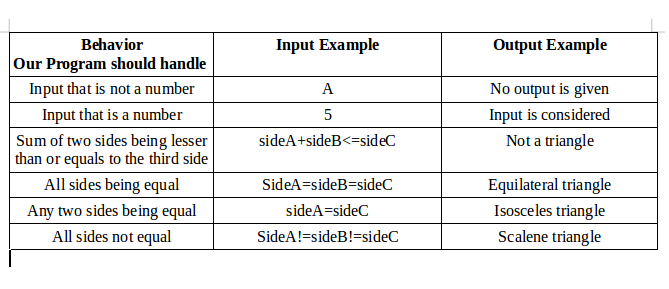

#Triangle Tracker

This project incorporates HTML and JS to give different types of triangles after
inputs have been given in a form. CSS is used for visual appeal.

##Author Information
Written by *Duncan Chege*. His first attempt at using JS in a webpage.

##Installation

1. On GitHub, navigate to the main page of the repository.
2. Under the repository name, click Clone or download.
3. In the Clone with HTTPs section, click to copy the clone URL for the repository.
4. Open Terminal.
5. Change the current working directory to the location where you want the cloned directory to be made.
6. Type `git clone`, and then paste the URL you copied in Step 2.
7. Press Enter. Now your local clone will be created.

##Behaviour Driven Development
Below shows an image identifying what the program should do before determining how to make it do it.

### Contact Information
To reach me, email me at: > dshege4@gmail.com

###License
-This project is licensed under the terms of the [MIT license](https://github.com/dunyung1/Web-work/blob/master/MIT%20License)
